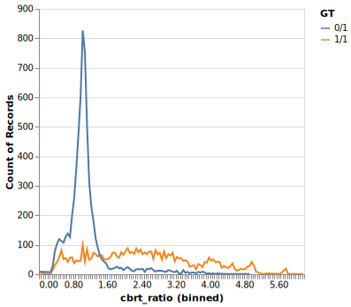

# Novotyper

This repository contains the code used during the development of a proof of concept for a structural variant genotyper tentatively called Novotyper.
- It was created to investigate whether the ratio of the mapping quality at an alternate contig constructed from a predicted SV to the mapping quality at the reference location (as calculated by Novoalign) could be used to accurately genotype structural variants from short-read WGS data.
- That is, we wanted to see whether the MAPQ ratio could be used to classify the sample as homozygous reference, heterozygous, or homozygous alternate for a given structural variant.

  

## Quick start

1. Obtain a VCF of the structural variants you would like to genotype.

2. Run the Snakemake workflow found in `workflow/Snakefile`.
    - Modify the `config/config.yaml` file to point to the correct locations for each input file and executable.
    - The workflow should perform the following steps (but you could run them yourself):

        | Tool | Purpose |
        | --- | --- |
        |`novoSV vcf2altscaffold` | Use the SVs from the VCF file along with the reference `.nix` file to generate a FASTA file containing the alt scaffolds. |
        |`novoindex` | Index the reference fasta + alt scaffolds fasta to create a new spiked `.nix` file. |
        | `novoalign` | Produce the BAM file by aligning the reads using the spiked `.nix` file. |
        | `novoSV zabedgraph` | Use the alt scaffolds FASTA and the BAM file to obtain the MAPQ bedgraph file. |
        | `novotyper` | Use the SV VCF, alt scaffolds FASTA, and MAPQ bedgraph to predict the genotypes and perform some benchmarking. |
        | `novoutil bgzf` [OPTIONAL] | Combine reference fasta + alt scaffolds fasta into a new fasta file, bgzip it, and index it with `samtools faidx`. Do this if you would like to have the spiked reference file to visualize the alignments in IGV. |

    - See [DAG](dag.svg).

## Report

- For a basic description of the reasoning behind each step and the results, please download `notebooks/report.html` and view it in your browser.

### Benchmarks

- [x] HG002 (reads and truth set obtained from [GIAB](https://github.com/human-pangenomics/HG002_Data_Freeze_v1.0))
- [ ] HG005 (reads and truth set obtained from [this paper](https://bmcgenomics.biomedcentral.com/articles/10.1186/s12864-022-08548-y))
- [ ] HG00513 (reads and truth set obtained from [HGSVC2](https://www.internationalgenome.org/data-portal/data-collection/hgsvc2))

## Acknowledgements

This work was part of my internship at [Novocraft](https://www.novocraft.com) (July 2024 - September 2024).
