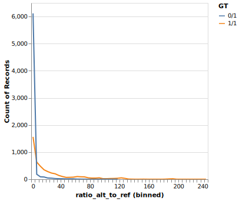

# Novocraft SV Genotyping Report

## Background

- Investigating the feasibility of an **alignment-based SV genotyper**.
- The functionality is based on Novocraft's HLA algorithm.
- A list of known structural variants is used to construct alternate contigs.
- A new reference consisting of the **reference genome + SV alt contigs** is used for alignment.
- If an SV from the list is present, more reads from this region are expected to align to the corresponding SV alt contig with a better mapping quality compared to the corresponding reference location.
- Thus, **MAPQ** along with other information may be used to select the combination of alleles which best account for the observed reads.

## Assumptions

- Let $R_{\text{MAPQ}} = \frac{\text{MAPQ}_{\text{alt}}}{\text{MAPQ}_{\text{ref}}}$.
- If the sample is **homozygous alternate**, we expect $\text{MAPQ}_\text{alt} \gg \text{MAPQ}_{\text{ref}}$, and therefore the MAPQ ratio should be very large ($R_{\text{MAPQ}} \gg 1$).
- If the sample is **homozygous reference**, we expect $\text{MAPQ}_\text{alt} \ll \text{MAPQ}_{\text{ref}}$, and therefore the MAPQ ratio should be very small ($R_{\text{MAPQ}} \ll 1$).
- If the sample is **heterozygous**, we expect $\text{MAPQ}_\text{alt} \approx \text{MAPQ}_{\text{ref}}$ and therefore the MAPQ ratio should be close to 1 ($R_{\text{MAPQ}} \approx 1$).

## Benchmarks to use

- HG002 (reads and truth set obtained from [GIAB](https://github.com/human-pangenomics/HG002_Data_Freeze_v1.0))
- HG005 (reads and truth set obtained from [this paper](https://bmcgenomics.biomedcentral.com/articles/10.1186/s12864-022-08548-y))
- HG00513 (reads and truth set obtained from [HGSVC2](https://www.internationalgenome.org/data-portal/data-collection/hgsvc2))

## Observations (in HG002)

### MAPQ ratio distribution



- Transformations (e.g., $\sqrt{R_{\text{MAPQ}}}$ or $\sqrt[3]{R_{\text{MAPQ}}}$) can make the distribution easier to visualize at a glance.
- How will the distribution of true negatives (homozygous reference) affect genotyping?
    - If it does not overlap significantly with the peak, 0/0 should be resolvable and performance characteristics may not be drastically affected.


- Zoom in on distirbution of $R_{\text{MAPQ}}$ to select reasonable cutoffs.
- The $R_{\text{MAPQ}}$ distribution has a mode at around 1, as expected.
- However, there is some overlap where SVs have an unexpected $R_{\text{MAPQ}}$ for the reported genotype.
- Using the following cutoff values yields a recall of 78% (genotype called correctly):

$$
\text{NaN} = ./. \\
[0,0.2) = 0/0 \\
[0.2,2.8) = 0/1 \\
[2.8,\infty) = 1/1
$$

## What does Novotyper do?

```coconut
from novotyper import genotyper as gt

vcf_info = gt.extract_info_from_vcf(sv_vcf, sample)
mapq_bedgraph = gt.read_mapq_bedgraph(mapq_bedgraph)

test_locs = (
    alts_fasta
    |> gt.read_alts_fasta_descriptions
    |> lift(,)(gt.extract_ref_locs_of_alts, gt.extract_sv_locs)
    |*> gt.join_ref_and_sv_locs
    |> gt.define_alt_test_locs
    |> gt.add_vcf_info_to_test_locs$(?, vcf_info)
    |> gt.get_pass_variants
)

ratio_results = (
    test_locs
    |> lift(,)(gt.get_ref_test_locs, gt.get_alt_test_locs)
    |> map$(gt.calculate_mapq$(?, mapq_bedgraph))
    |*> gt.join_and_calculate_mapq_ratio$(test_locs)
    |> gt.predict_genotype$(?, 0.2, 2.8)
)
```

- These functions are defined below ([Novotyper code](#novotyper-code)).

## HG002 genotype prediction results

| RECALL            |
| ----------------- |
| 78.08552373479796 |

| GT_unphased |        ./. |       0/0 |      0/1 |      1/1 |
| :---------- | ---------: | --------: | -------: | -------: |
| 0/1         | 0.00201787 | 0.0762468 | 0.774142 | 0.147593 |
| 1/1         | 0.00258309 | 0.0466678 | 0.161874 | 0.788875 |

| SVTYPE | Matching genotypes | Total | % Correct |
| :----- | -----------------: | ----: | --------: |
| DEL    |               4352 |  5464 |   79.6486 |
| INS    |               5600 |  7281 |   76.9125 |


## Things to consider for further development

### Overlaps in $R_{\text{MAPQ}}$ distributions

- Ideally the distributions for 0/0, 0/1, and 1/1 should be separable to distinguish genotypes.
- Overlaps mean **some incorrectly called genotypes may be inevitable**.
    - Also, MAPQ involves probability.
- Is there a systematic cause that can be addressed?
    - MAPQ ratio close to 1 (implying 0/1) but actually 1/1.
    - MAPQ ratio very low (implying 0/0) but actually 0/1 or 1/1.
    - MAPQ ratio very high (implying 1/1) but actually 0/0 or 0/1.
- Most of them tend to be in what look like repetitive or low-complexity regions.
- Is there a reason for the "spikes" in the MAPQ distributions near 0?

### Generalizability of cutoffs

- Can the cutoffs be applied to other samples?
    - The distributions could be affected by things such as sequencing parameters (coverage, etc.).
- To investigate cutoffs, other benchmarks (e.g. HGSVC2) can be used to see if the distributions are similar, or to combine all samples and see the overall distribution.
    - I tried to run it with the HG005 and HG00513 benchmarks, but `novoSV` and `novoindex` raise errors with the truth set VCFs.

### Precision

- To assess precision, we need to include **true negative SVs** (homozygous reference).
    - Use the HGSVC2 benchmark VCF, which contains 0/0 variants.
    - Use simulated reads, so you are completely certain about the alleles.
    - Use the calls from an SV caller and see whether precision can be improved without negatively affecting recall.
- A variant may be detected by some methods but **filtered out** due to not meeting certain criteria.
    - There are some examples of this in the GIAB small variant benchmarks.
    - This complicates the process of finding true negatives with which to assess precision.

### Other considerations

- **Split multiallelic VCF files** prior to alt contig generation (so that the only possible genotypes are 0/0, 0/1, 1/1, or ./.).
- Should there be a **minimum MAPQ**?
- Should repeat and **low-complexity regions** be masked?
- How will it perform on **other SV types**?
    - Duplications and inversions can be treated as insertions.
    - Translocations?
    - Since they are not present or clearly labelled in most benchmarks, how can performance on these SV types be evaluated?
<!---->
## Comparison to other genotypers

- The novoSV method has some similarities to graph-based SV genotypers (e.g., NPSV, SV2, Paragraph, vg, SVTyper, SVJedi-graph, GraphTyper, BayesTyper)
    - These use nodes of a graph to represent the different haplotypes instead of alt contigs.
    - They are usually much faster.
    - Some also struggle with nearby and overlapping SVs.
- The novoSV method can take inspiration from some of their ideas:
    - How can other information be incorporated to improve the performance? Can we into consideration the uniqueness of read mapping and alignment counts?
    - NovoAlign takes too long as it has to align to the whole genome. Can alignment be limited to only targeted regions?
- What would be the advantages of novoSV?
    - Can it be used to improve the precision of other SV callers by a significant amount?

## Known limitations

- This method is limited to trying to detect and genotype known SVs.
    - It cannot detect _de novo_ SVs.
    - A library of known SVs of interest (e.g., those associated with a phenotype or disease, or those previously called by another SV caller) will be useful for this method.

# Novotyper code

```python
import re

import pandas as pd
import pyranges as pr
import polars as pl
import bioframe as bf
import numpy as np
import altair as alt
```

```python
alt.data_transformers.enable("vegafusion")
```

## Load data

```python
def read_alts_fasta_descriptions(alts_fasta: Path) -> pl.DataFrame:
    with open(alts_fasta, "r") as file:
        records = re.findall(r">([\d\w_]+) LN:(\d+) .+ rg:([\d\w:-]+)", file.read())

        fields: dict[str, list] = {
            "alt_contig": [],
            "ref_loc": [],
            "alt_contig_len": [],
        }

        for record in records:
            fields["alt_contig"].append(record[0])
            fields["alt_contig_len"].append(record[1])
            fields["ref_loc"].append(record[2])

        data = pl.DataFrame(fields)

    return data


alts_fasta_desc = read_alts_fasta_descriptions("outputs/HG002/alt_scaffolds.fa")

alts_fasta_desc.head()
```

### Extract reference regions

```python
def extract_ref_locs_of_alts(data: pl.DataFrame) -> pr.PyRanges:
    ref_locs_bf = bf.from_any(data.to_series(1).to_list())
    ref_locs_bf["alt_contig"] = pd.Series(data.to_series(0).to_list())
    ref_locs_of_alts = pr.PyRanges(
        ref_locs_bf.rename(
            columns={"chrom": "Chromosome", "start": "Start", "end": "End"}
        )
    )

    return ref_locs_of_alts


ref_locs = extract_ref_locs_of_alts(alts_fasta_desc)
ref_locs.head()
```

### Extract SV regions

```python
def extract_sv_locs(data: pl.DataFrame) -> pr.PyRanges:
    sv_locs = pr.PyRanges(
        data.select("alt_contig", "alt_contig_len")
        .with_columns(
            pl.col("alt_contig")
            .str.extract_groups(r"(\d+|\w+)_(\d+)_(\d+)_\d")
            .struct.rename_fields(["Chromosome", "Start", "End"])
            .alias("alt_contig_locs"),
            pl.col("alt_contig_len").str.to_integer(),
        )
        .unnest("alt_contig_locs")
        .with_columns(pl.col(["Start", "End"]).str.to_integer())
        .to_pandas()
    )

    return sv_locs


sv_locs = extract_sv_locs(alts_fasta_desc)
sv_locs.head()
```

### Join regions

```python
def join_ref_and_sv_locs(
    ref_locs_of_alts: pr.PyRanges, sv_locs: pr.PyRanges
) -> pd.DataFrame:
    locs = sv_locs.df.join(ref_locs_of_alts.df, rsuffix="_ref").drop(
        columns=["alt_contig_ref", "Chromosome_ref"]
    )

    return locs


locs = join_ref_and_sv_locs(ref_locs, sv_locs)
locs.head()
```

### Get subregions over which MAPQ will be tested

```python
def define_alt_test_locs(locs: pd.DataFrame) -> pd.DataFrame:
    test_locs = locs.copy()

    # Get size of context to determine where on alt to start testing
    test_locs["Start_alt_test"] = test_locs["Start"] - test_locs["Start_ref"]

    # Determine where to end testing
    test_locs["End_alt_test"] = np.where(
        test_locs["alt_contig_len"] == 1801,
        test_locs["Start"] + 1 - test_locs["Start_ref"],
        test_locs["Start_alt_test"] + test_locs["alt_contig_len"] - 1801,
    )

    return test_locs


test_locs = define_alt_test_locs(locs)
test_locs.head()
```

### Read in VCF to filter for only PASS variants

```python
def extract_info_from_vcf(vcf_file: Path, sample: str) -> pd.DataFrame:
    vcf = (
        pl.read_csv(
            vcf_file,
            separator="\t",
            comment_prefix="#",
            has_header=False,
            new_columns=[
                "CHROM",
                "POS",
                "ID",
                "REF",
                "ALT",
                "QUAL",
                "FILTER",
                "INFO",
                "FORMAT",
                sample,
            ],
            schema_overrides={"CHROM": pl.String},
        )
        .with_columns(
            pl.col("INFO")
            .str.extract_groups(r"SVLEN=([-\d]+);")
            .cast(pl.Int32)
            .alias("SVLEN")
            .struct.rename_fields(["SVLEN"]),
            pl.col("INFO")
            .str.extract_groups(r"SVTYPE=(\w+);")
            .alias("SVTYPE")
            .struct.rename_fields(["SVTYPE"]),
            pl.col(sample).str.extract(r"^([\d.\/\|]*):").alias("GT"),
        )
        .unnest(["SVLEN", "SVTYPE"])
        .select(["FILTER", "GT", "SVLEN", "SVTYPE"])
        .to_pandas()
    )

    return vcf


vcf_info = extract_info_from_vcf("resources/HG002/HG002_SVs_Tier1_v0.6.ALL.vcf", "HG002")
vcf_info.head()
```

```python
def add_vcf_info_to_test_locs(locs: pd.DataFrame, vcf: pd.DataFrame) -> pd.DataFrame:
    locs_with_info = pd.concat([locs, vcf], axis=1)
    locs_with_info.insert(1, "alt_start", [0] * locs_with_info.shape[0])
    return locs_with_info


test_locs_with_info = add_vcf_info_to_test_locs(test_locs, vcf_info)
test_locs_with_info.head()
```

```python
def get_pass_variants(locs: pd.DataFrame) -> pd.DataFrame:
    return locs.query('FILTER == "PASS" or FILTER == "."')


test_locs_with_info_pass_only = get_pass_variants(test_locs_with_info)
test_locs_with_info_pass_only
```

### Separate ref and alt test locs

```python
def get_ref_test_locs(test_locs: pd.DataFrame) -> pd.DataFrame:
    return test_locs.copy()[["alt_contig", "Chromosome", "Start", "End"]]


ref_test_locs = get_ref_test_locs(test_locs_with_info_pass_only)
ref_test_locs
```

```python
def get_alt_test_locs(test_locs: pd.DataFrame) -> pd.DataFrame:
    alt_test_locs = test_locs.copy()
    alt_test_locs["Chromosome"] = alt_test_locs["alt_contig"]
    alt_test_locs = alt_test_locs.copy()[
        ["alt_contig", "Chromosome", "Start_alt_test", "End_alt_test"]
    ].rename(columns={"Start_alt_test": "Start", "End_alt_test": "End"})

    return alt_test_locs


alt_test_locs = get_alt_test_locs(test_locs_with_info_pass_only)
alt_test_locs
```

## Prepare MAPQ

```python
def read_mapq_bedgraph(bedgraph_file: Path) -> pr.PyRanges:
    bedgraph: pd.DataFrame = pd.read_csv(
        bedgraph_file,
        sep=" ",
        header=0,
        skiprows=1,
        names=["Chromosome", "Start", "End", "MAPQ"],
        dtype={"Chromosome": str},
    )

    return pr.PyRanges(bedgraph)


mapq_bedgraph = read_mapq_bedgraph("outputs/HG002/sv.sorted.bedgraph")
mapq_bedgraph
```

### Calculate MAPQ over REF test locs

```python
def calculate_mapq(test_locs: pd.DataFrame, mapq_bedgraph: pd.DataFrame):
    return (
        pr.PyRanges(test_locs)
        .extend(100)
        .join(mapq_bedgraph)
        .df.groupby("alt_contig")
        .agg({"MAPQ": "mean"})
    )


ref_mapq = calculate_mapq(ref_test_locs, mapq_bedgraph)
ref_mapq
```

### Calculate MAPQ over ALT test locs

```python
alt_mapq = calculate_mapq(alt_test_locs, mapq_bedgraph)
alt_mapq
```

## Join all results and calculate $R_{\text{MAPQ}}$

```python
def join_and_calculate_mapq_ratio(
    locs_with_info: pd.DataFrame, ref_mapq: pd.DataFrame, alt_mapq: pd.DataFrame
):
    results = (
        locs_with_info.set_index("alt_contig")
        .join(ref_mapq, rsuffix="_ref")
        .join(alt_mapq, rsuffix="_alt")
        .reset_index()
        .set_index(["Chromosome", "Start", "End"])
    )

    results["ratio_alt_to_ref"] = results["MAPQ_alt"] / results["MAPQ"]

    results["sqrt_ratio"] = np.sqrt(results["ratio_alt_to_ref"])
    results["cbrt_ratio"] = np.cbrt(results["ratio_alt_to_ref"])

    return results


results = join_and_calculate_mapq_ratio(
    test_locs_with_info_pass_only,
    ref_mapq,
    alt_mapq
)
results
```

## Plot distributions of MAPQ ratio

```python
def plot_mapq_distribution(results: pd.DataFrame) -> tuple[alt.Chart]:
    inf = np.inf

    mapq_chart = (
        alt.Chart(
            results.query("not ratio_alt_to_ref.isna() and ratio_alt_to_ref != @inf")
        )
        .mark_line()
        .encode(
            alt.X("ratio_alt_to_ref:Q").bin(maxbins=100),
            y="count()",
            color=alt.Color("GT"),
        )
        .interactive()
    )

    mapq_chart_detailed = (
        alt.Chart(
            results.query("not ratio_alt_to_ref.isna() and ratio_alt_to_ref != @inf")
        )
        .mark_line()
        .encode(
            alt.X("ratio_alt_to_ref:Q").bin(maxbins=5000),
            y="count()",
            color=alt.Color("GT"),
        )
        .interactive()
    )

    sqrt_mapq_chart = (
        alt.Chart(
            results.query("not ratio_alt_to_ref.isna() and ratio_alt_to_ref != @inf")
        )
        .mark_line()
        .encode(
            alt.X("sqrt_ratio:Q").bin(maxbins=250), y="count()", color=alt.Color("GT")
        )
        .interactive()
    )

    cbrt_mapq_chart = (
        alt.Chart(
            results.query("not ratio_alt_to_ref.isna() and ratio_alt_to_ref != @inf")
        )
        .mark_line()
        .encode(
            alt.X("cbrt_ratio:Q").bin(maxbins=250), y="count()", color=alt.Color("GT")
        )
        .interactive()
    )

    return (mapq_chart, mapq_chart_detailed, sqrt_mapq_chart, cbrt_mapq_chart)


mapq_chart, mapq_chart_detailed, sqrt_mapq_chart, cbrt_mapq_chart = plot_mapq_distribution(results)

out_dir = "outputs/HG002"
mapq_chart.save(f"{out_dir}/mapq_chart.svg")
mapq_chart_detailed.save(f"{out_dir}/mapq_chart_detailed.svg")
sqrt_mapq_chart.save(f"{out_dir}/sqrt_mapq_chart.svg")
cbrt_mapq_chart.save(f"{out_dir}/cbrt_mapq_chart.svg")
```

## Make predictions based on $R_{\text{MAPQ}}$

$$
\text{NaN} = ./. \\
[0,0.2) = 0/0 \\
[0.2,2.8) = 0/1 \\
[2.8,\infty) = 1/1 \\
$$

```python
def predict_genotype(
    results: pd.DataFrame, lower_het_bound: float, upper_het_bound: float
) -> pd.DataFrame:
    predictions = results.copy()

    predictions["prediction"] = np.where(
        results["ratio_alt_to_ref"].isna(),
        "./.",
        np.where(
            results["ratio_alt_to_ref"] >= upper_het_bound,
            "1/1",
            np.where(results["ratio_alt_to_ref"] < lower_het_bound, "0/0", "0/1"),
        ),
    )

    predictions["GT_unphased"] = np.where(
        predictions["GT"].str.contains('/'),
        predictions["GT"],
        predictions["GT"].map(
        {"0|0": "0/0", "0|1": "0/1", "1|0": "0/1", "1|1": "1/1"}),
    )

    predictions["GT_concordance"] = (
        predictions["prediction"] == predictions["GT_unphased"]
    )

    return predictions


predictions = predict_genotype(results, 0.2, 2.8)
predictions
```

```python
def calculate_performance(predictions: pd.DataFrame) -> str:
    recall = 100 * sum(predictions["GT_concordance"]) / predictions.shape[0]

    correct_predictions_by_svtype = predictions.groupby("SVTYPE").agg(
        {"GT_concordance": ["sum", "count"]}
    )
    correct_predictions_by_svtype["pct"] = (
        100
        * correct_predictions_by_svtype[("GT_concordance", "sum")]
        / correct_predictions_by_svtype[("GT_concordance", "count")]
    )

    contingency_table = pd.crosstab(
        predictions["GT_unphased"], predictions["prediction"], normalize="index"
    )

    return "\n\n".join(
        [f"|RECALL|\n|---|\n|{recall}|",
        contingency_table.to_markdown(),
        correct_predictions_by_svtype.to_markdown(),]
    )


performance = calculate_performance(predictions)

with open(f"{out_dir}/summary.md", "w") as file:
    print(performance, file=file)
```